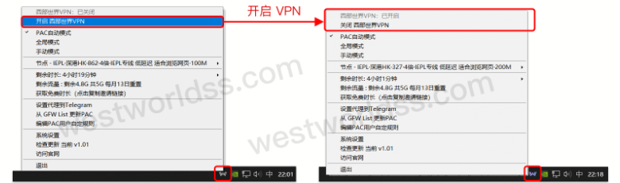
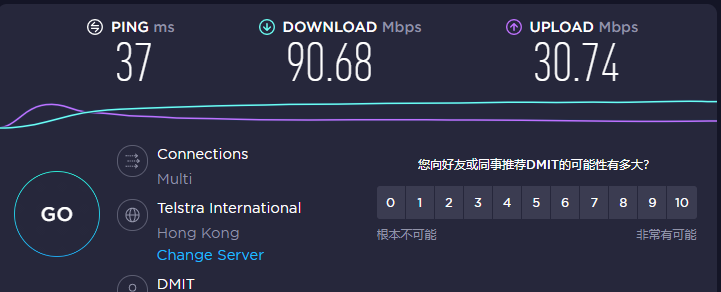
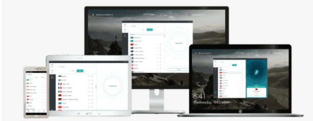
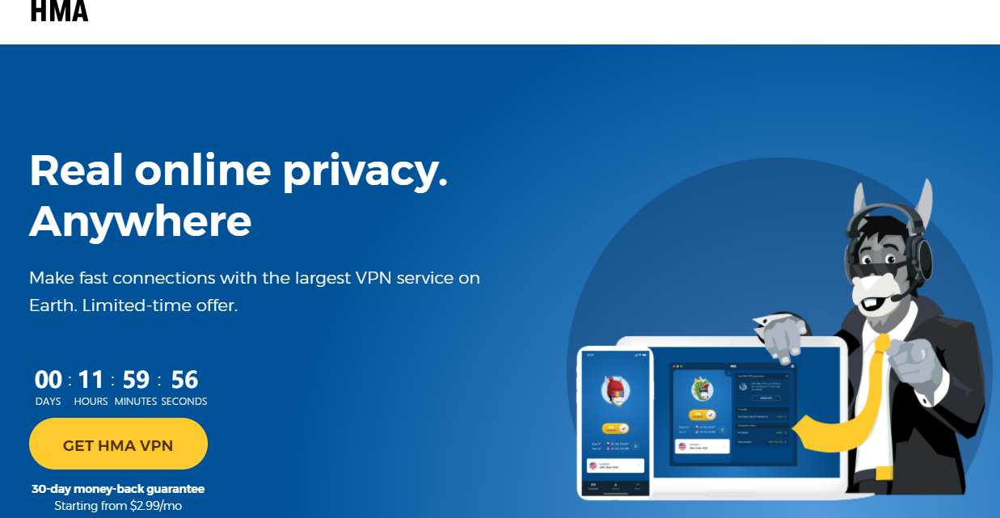

# 三款世界排名Top3的稳定好用梯子软件，免费试用而且真的很稳
## 今天给大家介绍三款稳定好用，排名世界前Top3的梯子软件，我选梯子除了好用便宜之外，同时也得是运营时间比较久不用担心跑路的那种，所以基本上能排的雷都给大家排完了，这几个梯子经过我自己长时间的验证，都是属于稳定好用靠谱的行列，并且手机和电脑上也能够同时使用，支持多设备登录很方便。

## 一、Westworld梯子

### 地址：[点击访问官网](https://xbsj3462.fun/i/th037)

这款梯子的运营商在欧洲，是我用的比较久的一款梯子软件，支持ios客户端，安卓客户端，windows客户端等多平台同时登陆使用，后台中英双语可以切换，不会出现语言障碍。

简单几步就能开启使用，后台所有线路都是IEPL专线，网络全天都很稳定，而且很快，我个人感觉这个梯子软件应该是同等价位当中，使用体验最好的，甚至好的远远超过了预期。

节点地区也很丰富，能够解锁奈飞等流媒体的观看权限，并且观看时候的网速体验很流畅，不会出现卡顿的情况，尤其后台有很完善的[梯子软件](https://www.dazhuanlan.com/yuluoqingtian/topics/2635282)使用教程，对于科学上网新手而言，只需要阅读一两分钟就能够学会使用这个软件。

这个梯子软件不会保存用户的使用数据，并且加密系统也很完善，注册时候的邮箱地址可以随意填写，不用接收验证邮件，充分保护了用户的隐私。

最最最重要的一点就是，它的速度是真的快！附一张SpeedTest的测速截图：

## 二、Surfshark

### 地址：[点击访问官网](https://surfshak.com/)

这款电脑和手机都能用的梯子软件，作为备用梯子其实是一个很不错的选择，可能和很多老牌梯子相比较而言，比如Westworld，Express等等，它还比较新，但也只是相对而言，就这个梯子机场本身的运营时长，也已经有两三年之久，而且服务质量从我一个多月的使用时间来看，还算可以的。

同样是不记录用户使用数据，采取零日志的准则，和Westworld一样，它不限制用户使用的设备数，观影体验也比较流畅，令我眼前一亮的是它有一个软件白名单功能，就是可以选择某个特定的软件作为VPN的使用对象。

从我自己个人的使用体验来说，性价比是没有Westworld这款梯子软件高，但是如果作为备用梯子，还是很不错的。

## 三、HideMyAss

### 地址：[点击访问官网](https://hidemyasws.com/)

这个梯子软件看名字就很神奇，说实话，我当初是被它名字吸引的，想着多秀逗的团队才会取一个这样的名字，确实有被笑到，不过具体去使用之后，感觉也是不错的，一直躺在我的备用梯子列表当中。

同样是零日志准则，保护了用户的隐私，并且能够对用户的浏览数据和访问数据进行加密（不过貌似所有梯子都这样，我实在是没什么特别的词能用来描述了）

反正这是一款不怎么会出错的梯子软件，没有特别亮眼的优点，只是在你回头去看的时候，它一直在那里。

